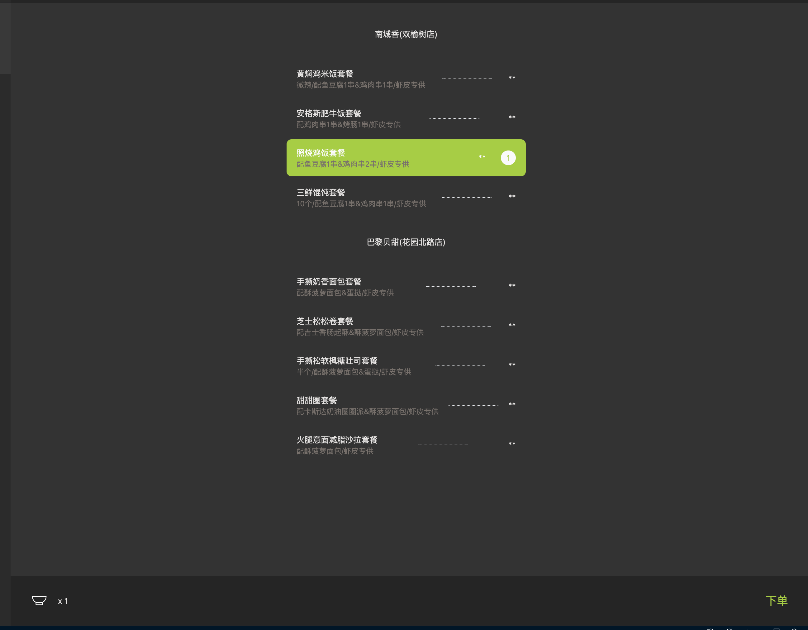

# vscode-meican README

 

vscode-meican 是基于 VSCode 的美餐客户端。支持准时提醒订餐、编码时 「沉浸式」点餐、查看当前订单状态等功能。

## 已支持功能

### 唤起美餐界面

插件安装后，可以在 VSCode 状态栏看到 vscode-meican 图标、点击即可唤起美餐界面:

### 登录

首次唤起美餐界面，会自动跳转到登录页面，按提示输入邮箱、密码即可。

> 输入邮箱、密码登录成功后。`cookie` 会存储至[VSCode GlobalStorage](https://code.visualstudio.com/api/references/vscode-api#ExtensionContext.globalState).

### 点餐

登录之后，如果当前时间段开放点餐的话，就可以看到具体的餐品列表。

点击具体餐品，之后点击右下角的 「下单」，按提示操作即可完成下单。

### 订单状态

点单成功之后，会跳转到订单详情界面，如下，可以看到当前订单的信息、送到的地址、以及当前的进度:

### 定时提醒

插件激活后，每天 15:30 分会提醒点餐，可以根据工作安排决定是否点加班餐。

> 目前不支持自定义时间。

### 个人信息

展示当前登录用户的账号、手机号、用户编号:

Made with  ❤️ by await-ovo

Enjoy!

